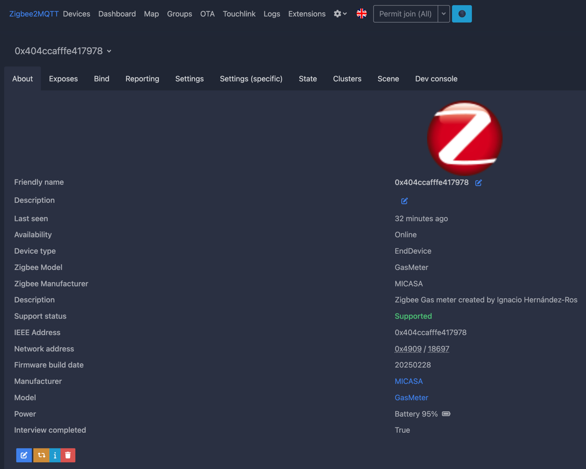
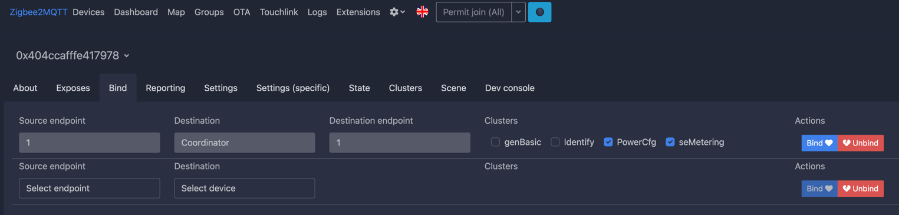
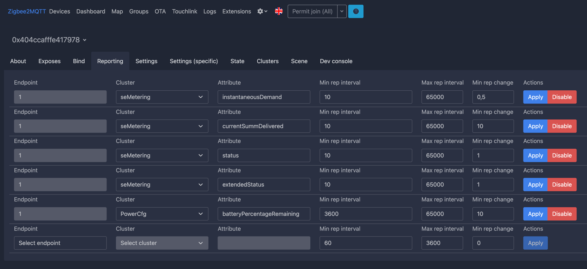
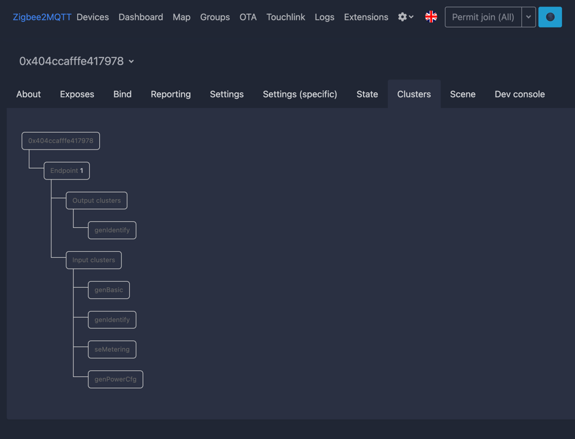

# Zigbee GAS counter

This project is a DIY Zigbee-enabled gas meter that measures and tracks gas consumption. The device integrates with Zigbee2MQTT and Home Assistant, providing accurate readings for energy management and analysis. It’s designed to be battery-powered and operate autonomously, addressing common challenges of similar solutions.

## Features

- Real-time gas consumption tracking in cubic meters (m³).
- Zigbee communication for seamless integration with Zigbee2MQTT and Home Assistant.
- Battery-powered for installation flexibility.
- Built-in counter to prevent data loss if the network or Home Assistant goes offline.
- Easy setup and minimal hardware requirements.
- OTA firmware update.

## Why Zigbee for DIY Projects?

Zigbee is a low-power, reliable wireless protocol ideal for IoT devices. Unlike Wi-Fi, Zigbee consumes minimal energy, making it perfect for battery-operated devices. While commercial Zigbee gas meters aren’t readily available, this project demonstrates how to build one from scratch using affordable components and the ESP32-C6 module.

## Screenshots

Below are some screenshots of the device integrated into Zigbee2MQTT:







## How It Works

1. The gas meter’s rotating wheel has a built-in magnet.
1. A magnetic sensor detects each full rotation of the wheel, corresponding to a predefined volume of gas.
1. The ESP32-C6 processes the data, maintaining a cumulative counter (currentSummDelivered) and calculating instantaneous demand (instantaneousDemand) in m³/h.
1. These metrics are sent via Zigbee to Zigbee2MQTT, which forwards them to Home Assistant.

## Motivation

Before this project, I used a modified door sensor to monitor gas usage. While functional, it had several drawbacks:

1. **Short battery life**: The door sensor required frequent battery replacements.
2. **Data loss**: If Zigbee2MQTT or Home Assistant went offline, pulse data was lost, leading to discrepancies.
3. **Complexity**: Managing counters and automations in Home Assistant was cumbersome.

After searching for commercial Zigbee gas meters and finding none, I decided to create a custom device tailored to my needs.


## Project Status

!!HELP NEEDED!! December 9th 2025
I can't finish the device software in a reliable manner. Here is the list of things that still don't work properly.

1 - Home assistant support for the smart meter devices that reports m³/h as a unit of power (when the fluid is GAS) is not supported. So I created another cluster for reporting the counter as an analog input cluster. Note this is a problem because the maximum count value of a float is 16777216 but I added this just for testing.
2 - Since then, new counter values are not transmitted. In the logs they are OK, but the zigbee side is getting me crazy. Nothing works as it should be with the esp-idf framework. The documentation is really poor and hard to find in examples.
3 Pressing the device button for 5 seconds DOES NOT LEAVE THE NETWORK! Don't know why.
	- The button long press gesture is recognized.
	- The device calls `esp_zb_zdo_device_leave_req(&leave_request, leave_callback, NULL);` as it should be as per the documentation
	- There are hooks in the `esp_zb_app_signal_handler` function that ARE NEVER CALLED, no error, no debug information, no nothing useful to move forward from this point.
	- The `leave_callback` function is also never called
4 - Reporting is no longer working and no values are received in the coordinator since I added the analog input cluster. No errors are reported so this is difficult to debug.
5 - When the main button is pressed and released 4 or 5 times, the device resets. Also don't know why and it is hard to debug
6 - Exiting from deep sleep using the device button causes another unexpected device reset

So, if you have some experience with ESP32 and Zigbee devices or you just want this project to move forward. PLEASE CONTACT ME and help me debug all what is happening!

This project is still in the development phase. While it is not yet deployed for real gas consumption measurement, I have a working prototype on an **ESP32-C6-WROOM-1 development board** in a test environment. The prototype uses two buttons: one simulating the gas meter pulses and the other functioning as the main device button. The software is fully operational, I'm actually working on the hardware side.

For the time being, I've decided to use a 2S lipo battery that can hold 8.4v and can be safely discharged to 7.0v. I've already develop the software to report battery at 100% level when it is 8.4v and 0% when it is 7.0v. There is also an attribute to get the battery voltage in millivolts.

I've provided an update to Zigbee2mqtt to generalise the seMetering cluster so it can be used for electrical meters and gas meters. Hopefully that will simplify a lot the code to add to the external converters and that code can be reused by others

I've just implemented and tested OTA support so in theory I could just distribute new firmware versions

### What is missing and how you can help

See the **TODO** section below for specific tasks that need to be completed.

One of my main concerns is **power consumption and battery life**. The software includes battery status measuring and reporting.

Currently, the prototype runs on a development board, but the long-term goal is to use only the **ESP32-C6 chip**, eliminating unnecessary components. To achieve this, I will need help reviewing schematics and PCB designs, as **I’m not an expert in hardware design—just an enthusiast**. If you have experience in this area, your input would be greatly appreciated.

For discussions and contributions, please join the ongoing thread on the Home Assistant Community: 👉 [Zigbee Gas Counter](https://community.home-assistant.io/t/zigbee-gas-counter/833557)

## Getting Started

### Required Hardware

To build this project, you’ll need:

- **ESP32-C6-WROOM-1** or a compatible development board.
- **Magnetic reed switch** for pulse detection.
- **10kΩ resistor** (pull-down).
- **8.4 LiPo battery**. TBD
- **DC to DC voltage step down**. I'm temporarily using an old MP1584 set to convert 8.4v to 3.3v.
- Optional: Custom 3D-printed enclosure for the hardware.

### Software Requirements

- **ESP-IDF (Espressif IoT Development Framework)**: [Installation Guide](https://docs.espressif.com/projects/esp-idf/en/latest/esp32/get-started/index.html)
- **Zigbee2MQTT**: [Setup Guide](https://www.zigbee2mqtt.io/)
- **Home Assistant**: [Official Website](https://www.home-assistant.io/)

## **Setup Instructions**

### **1. Clone the Repository**

First, download the project code from the GitHub repository:

```bash
git clone https://github.com/IgnacioHR/ZigbeeGasMeter.git
cd ZigbeeGasMeter
```

### **2. Configure the target chip**

Set the corrent target for the ESP32-C6:

```bash
idf.py --preview set-target ESP32C6
```

### **3. Install Dependencies**

Ensure ESP-IDF and its tools are installed on your machine.

### **4. Erase Flash Memory**

Clear previous configurations:

```bash
idf.py -p PORT erase-flash
```

### **4. Build and Flash**

Compile the code and flash it to the ESP32-C6 board:

```bash
idf.py build
idf.py -p PORT flash
idf.py -p PORT monitor
```

## Advanced Configuration

- Leave the network and join again: Long-press the device button for 5 seconds.
- Set Counter Value: Send a Zigbee command to synchronize with your gas meter.

### NVS (Non-Volatile Storage)

The cumulative gas consumption (currentSummDelivered) is stored in the device’s NVS to prevent data loss. The counter is automatically restored upon reboot.

### Battery Optimization

The device uses sleep modes to conserve energy. It wakes up:

- When gas consumption is detected.
- Periodically (e.g., every hour) to send reports.

## Customization

You can adapt this project for other pulse-based meters (e.g., water or electricity) by modifying the code to reflect the appropriate measurement units and formulas.

## Manufacturer information

This project includes a custom manufacturer name and code:

- Name: “MICASA” – A playful mix of “mi casa” (my home) in Spanish.
- Code: 0x8888 – Chosen arbitrarily for this DIY project.

## SDK Resources

- [ESP Zigbee SDK Docs](https://docs.espressif.com/projects/esp-zigbee-sdk)
- [ESP Zigbee SDK Repo](https://github.com/espressif/esp-zigbee-sdk)

## Contributing

If you want to contribute or improve this project, feel free to fork the repository and open a pull request. Suggestions are welcome!

## TODO

Here are the planned improvements:

1. Design a custom PCB for the ESP32-C6, connectors and resistors.
2. Create a 3D-printed enclosure for secure installation.

## Acknowledgments

By improving the content structure and emphasizing actionable steps, this README not only serves as a guide for your project but also inspires others to create their own Zigbee devices.

## License

[License](https://creativecommons.org/licenses/by-nc-sa/4.0/deed.en)
